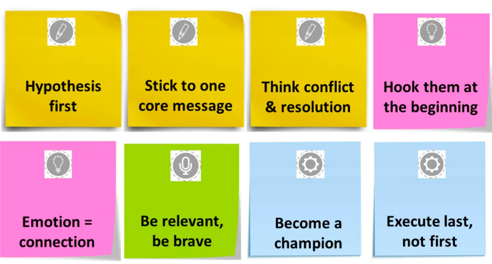

# Story Telling with Data
Notes by Daniel Carpenter
Dec-23

- [1 Intro](#intro)
  - [1.1 Principles of
    Storytelling](#principles-of-storytelling)
  - [1.2 Developing a Narrative
    Structure in Design](#developing-a-narrative-structure-in-design)
  - [1.3 Story
    Structures](#story-structures)
  - [1.4 Effective Methods of
    Storytelling](#effective-methods-of-storytelling)
- [2 Create: Incorporating
  Engagement Techniques](#create-incorporating-engagement-techniques)
  - [2.1 Takeaways](#takeaways)
  - [2.2 Titles](#titles)
  - [2.3 Hooks](#hooks)
  - [2.4 Personal
    Stories](#personal-stories)
  - [2.5 Digesting
    Data](#digesting-data)
  - [2.6 Finish a
    Scenario](#finish-a-scenario)
- [3 EXECUTE](#execute)
  - [3.1 ](#section)

> [Udemy Course
> Here](https://www.udemy.com/course/unlock-the-story-from-data/)

 

Takeaways

# Intro

## Principles of Storytelling

1.  **Influence over Creativity**: Focus on influence rather than on
    creativity or design quality.
2.  **Story Precedes Evidence**: Establish the story before presenting
    evidence.
3.  **Project Outline First**: Start with an outline of ideas.

## Developing a Narrative Structure in Design

> **Single Story Focus**: Maintain emphasis on one story throughout the
> message.

## Story Structures

| Stage      | Description                                                                             |
|------------|-----------------------------------------------------------------------------------------|
| Setup      | Introduce characters and context, outline goals and the story’s importance.             |
| Conflict   | Identify and capture the conflict using various sources like data anomalies and briefs. |
| Resolution | Detail the decision and resolution of the story.                                        |

## Effective Methods of Storytelling

| Type               | Description                                                                     |
|--------------------|---------------------------------------------------------------------------------|
| Deductive          | Start with a hypothetical answer, establish a point of view, then observe.      |
| Tree Method        | Begin with a hypothesis, support with reasons, and back with evidence.          |
| **SCQA Framework** | **Structure storytelling using Situation, Complication, Question, and Answer.** |

Here’s a concise outline in markdown format, organizing the information
on engagement techniques, personal stories, digesting data, and
finishing scenarios:

# Create: Incorporating Engagement Techniques

## Takeaways

1.  **Use Existing Archetypes**: Don’t reinvent the wheel; utilize
    familiar story archetypes.
2.  **Relatability**: Make the story relatable to the audience.
3.  **Audience Involvement**: Engage the audience actively in the story.

## Titles

| Criteria       | Description                               |
|----------------|-------------------------------------------|
| Useful         | Should be beneficial and relevant.        |
| Urgent         | Convey why the story is important now.    |
| Unique         | Highlight what makes the story stand out. |
| Ultra-Specific | Be precise and clear about the content.   |

- **Effective Title Types**:
  - How-to Guides
  - Lists (e.g., “N Things You Should Do”)
  - Questions
  - Inclusion of Verbs

## Hooks

- **Types of Hooks**:
  - Killer Stat
  - Quote
  - Question (e.g., “How would you feel if…”)
  - Comparison (e.g., what another company did)
  - Scenario (e.g., “What if…”)
  - Confession

## Personal Stories

- **Benefits**:
  - Provide new, authentic material.
  - Relatable to the audience.
- **Types**:
  - Personal interactions or experiences.
  - Customer stories to individualize and apply real attitudes.
  - Case studies to see expert approaches.

## Digesting Data

- **Technique**: Use metaphors as a visual aid to unpack data.
- **Avoidance**: Steer clear of random, cliché, offensive, or overused
  metaphors.

## Finish a Scenario

- **Types**:
  - **Vision**: Imagining success (“What if we got it right?”)
  - **Neutral**: Considering possibilities (“What if something
    happens?”)
  - **Fork in Road**: Exploring alternatives (“What if we take another
    path?”)
  - **Doomsday**: Contemplating failure (“What if we don’t get it
    right?”)

# EXECUTE

## 
